Geog6300: Lab 6
================

## Regression

``` r
#install.packages("lmtest")
library(sf)
library(tidyverse)
library(tmap)
library(car)  
library(lmtest)
```

**Overview:** This lab focuses on regression techniques. You’ll be
analyzing the association of various physical and climatological
characteristics in Australia with observations of several animals
recorded on the citizen science app iNaturalist.

\###Data and research questions###

Let’s import the dataset.

``` r
lab6_data<-st_read("data/aus_climate_inat.gpkg")
```

    ## Reading layer `aus_climate_inat' from data source 
    ##   `/Users/unu61706/Downloads/Data Science labs/Lab 6/data/aus_climate_inat.gpkg' 
    ##   using driver `GPKG'
    ## Simple feature collection with 716 features and 22 fields
    ## Geometry type: POLYGON
    ## Dimension:     XY
    ## Bounding box:  xmin: 113.875 ymin: -43.38632 xmax: 153.375 ymax: -11.92074
    ## Geodetic CRS:  WGS 84 (CRS84)

The dataset for this lab is a 1 decimal degree hexagon grid that has
aggregate statistics for a number of variables:

- ndvi: NDVI/vegetation index values from Landsat data (via Google Earth
  Engine). These values range from -1 to 1, with higher values
  indicating more vegetation.
- maxtemp_00/20_med: Median maximum temperature (C) in 2000 or 2020
  (data from SILO/Queensland government)
- mintemp_00/20_med: Median minimum temperature (C) in 2020 or 2020
  (data from SILO/Queensland government)
- rain_00/20_sum: Total rainfall (mm) in 2000 or 2020 (data from
  SILO/Queensland government)
- pop_00/20: Total population in 2000 or 2020 (data from NASA’s Gridded
  Population of the World)
- water_00/20_pct: Percentage of land covered by water at some point
  during the year in 2000 or 2020
- elev_med: Median elevation (meters) (data from the Shuttle Radar
  Topography Mission/NASA)

There are also observation counts from iNaturalist for several
distinctively Australian animal species: the central bearded dragon, the
common emu, the red kangaroo, the agile wallaby, the laughing
kookaburra, the wombat, the koala, and the platypus.

Our primary research question is how the climatological/physical
variables in our dataset are predictive of the NDVI value. We will build
models for 2020 as well as the change from 2000 to 2020. The second is
referred to as a “first difference” model and can sometimes be more
useful for identifying causal mechanisms.

\###Part 1: Analysis of 2020 data###

We will start by looking at data for 2020.

**Question 1** *Create histograms for NDVI, max temp., min temp., rain,
and population, and water in 2020 as well as elevation. Based on these
graphs, assess the normality of these variables.*

``` r
print(head(lab6_data))
```

    ## Simple feature collection with 6 features and 22 fields
    ## Geometry type: POLYGON
    ## Dimension:     XY
    ## Bounding box:  xmin: 113.875 ymin: -29.52992 xmax: 115.875 ymax: -22.31304
    ## Geodetic CRS:  WGS 84 (CRS84)
    ##   grid_id maxtemp_00_med maxtemp_20_med mintemp_00_med mintemp_20_med
    ## 1     G92         31.100         31.700         17.200         18.500
    ## 2    G110         26.500         27.200         12.750         14.025
    ## 3    G111         28.900         29.850         15.025         16.450
    ## 4    G112         30.650         31.200         16.700         18.000
    ## 5    G113         32.825         33.500         17.350         18.750
    ## 6    G129         26.800         27.375         12.200         13.150
    ##   rain_00_sum rain_20_sum ndvi_00_med ndvi_20_med water_00_pct water_20_pct
    ## 1    175386.8     40084.8    0.284045   0.1830391  0.035859726  0.004002513
    ## 2    127536.9     89407.1    0.000000   0.0000000  0.009075255  0.004491088
    ## 3    121836.5     51763.4    0.283010   0.2225348  0.004909831  0.002908668
    ## 4    159591.0     44964.7    0.252225   0.1921783  0.016382380  0.013962255
    ## 5    205212.8     53343.0    0.256260   0.1932478  0.022735206  0.007795593
    ## 6    114236.1    110501.4    0.000000   0.0000000  0.003407553  0.005087990
    ##       pop_00     pop_20 elev_med Central.Bearded.Dragon Common.emu Red.kangaroo
    ## 1   38.39824   51.43013       70                      0          1            1
    ## 2 1882.98616 2521.62865        0                      0          1            0
    ## 3   76.31120  102.19668      167                      0          6            0
    ## 4   30.85762   41.32482      161                      0          1            0
    ## 5  198.27375  265.75401       80                      0          2            0
    ## 6 3184.40681 4266.20747        0                      0          9            0
    ##   Agile.wallaby Laughing.kookaburra Wombat Koala Platypus
    ## 1             0                   0      0     0        0
    ## 2             0                   0      0     0        0
    ## 3             0                   0      0     0        0
    ## 4             0                   0      0     0        0
    ## 5             0                   0      0     0        0
    ## 6             0                   0      0     0        0
    ##                             geom
    ## 1 POLYGON ((114.375 -24.33377...
    ## 2 POLYGON ((114.875 -28.66389...
    ## 3 POLYGON ((114.875 -26.93184...
    ## 4 POLYGON ((114.875 -25.19979...
    ## 5 POLYGON ((114.875 -23.46774...
    ## 6 POLYGON ((115.375 -29.52992...

``` r
ggplot(lab6_data, aes(x = ndvi_00_med)) + 
  geom_histogram(bins = 30) + 
  theme_minimal() + 
  labs(title = "Distribution of NDVI at time 00")
```

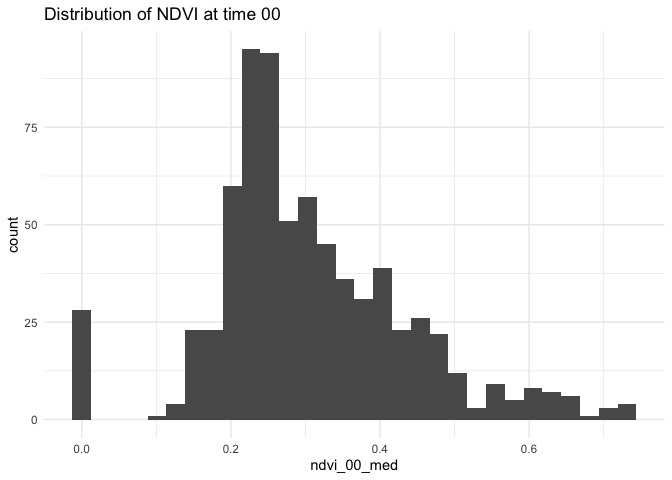<!-- -->

``` r
ggplot(lab6_data, aes(x = maxtemp_20_med)) +
  geom_histogram(bins = 30) +
  theme_minimal() +
  labs(title = "Distribution of Maximum Temperature 2020")
```

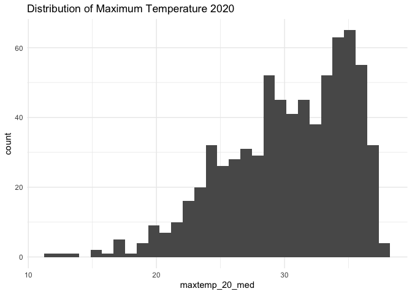<!-- -->

``` r
ggplot(lab6_data, aes(x = mintemp_20_med)) +
  geom_histogram(bins = 30) +
  theme_minimal() +
  labs(title = "Distribution of Minimum Temperature 2020")
```

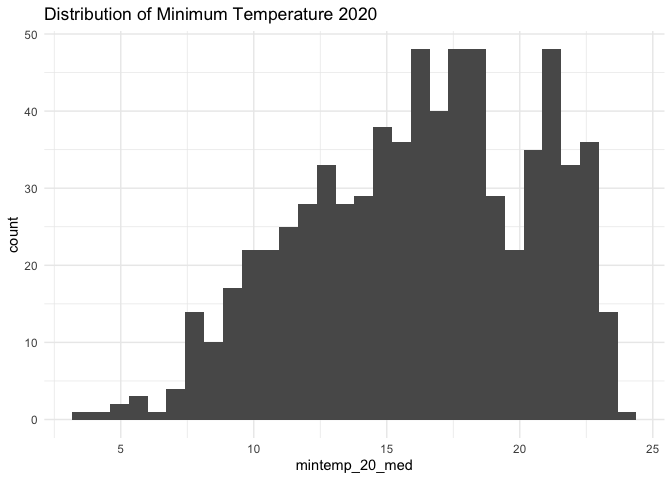<!-- -->

``` r
ggplot(lab6_data, aes(x = rain_20_sum)) +
  geom_histogram(bins = 30) +
  theme_minimal() +
  labs(title = "Distribution of Rainfall 2020")
```

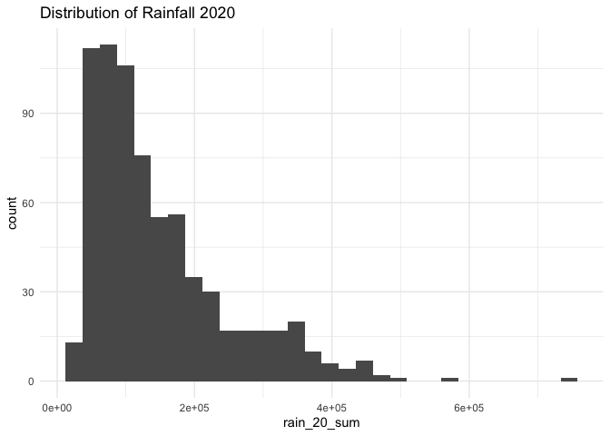<!-- -->

``` r
ggplot(lab6_data, aes(x = pop_20)) +
  geom_histogram(bins = 30) +
  theme_minimal() +
  labs(title = "Distribution of Population 2020")
```

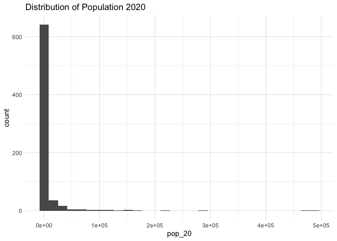<!-- -->

``` r
ggplot(lab6_data, aes(x = water_20_pct)) +
  geom_histogram(bins = 30) +
  theme_minimal() +
  labs(title = "Distribution of Water Percentage 2020")
```

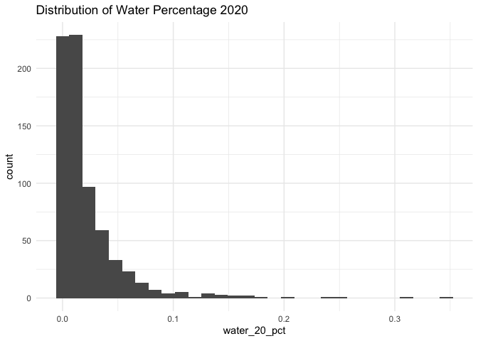<!-- -->

``` r
ggplot(lab6_data, aes(x = elev_med)) +
  geom_histogram(bins = 30) +
  theme_minimal() +
  labs(title = "Distribution of Median Elevation")
```

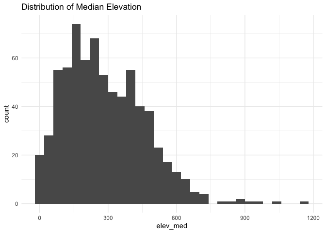<!-- -->

{Based on the histograms of the of environmental data, it is clear that
the variables are not normally distributed}

**Question 2** *Use tmap to map these same variables using Jenks natural
breaks as the classification method. For an extra challenge, use
`tmap_arrange` to plot all maps in a single figure.*

``` r
#Function to create a map for a specific variable
create_map <- function(var_name, title) {
  tm_shape(lab6_data) +
    tm_polygons(var_name,
                style = "jenks",
                palette = "YlOrRd",
                title = title) +
    tm_layout(legend.position = c("right", "bottom"),
              legend.title.size = 1,
              legend.width = 1)  # Increase legend width
}

# Create maps for the desired variables
map_ndvi <- create_map("ndvi_20_med", "NDVI 2020")
map_temp_max <- create_map("maxtemp_20_med", "Max Temp 2020")
map_temp_min <- create_map("mintemp_20_med", "Min Temp 2020")
map_rain <- create_map("rain_20_sum", "Rainfall 2020")
map_pop <- create_map("pop_20", "Population 2020")
map_water <- create_map("water_20_pct", "Water Percentage 2020")
map_elev <- create_map("elev_med", "Elevation")

# Arrange maps in a single figure
tmap_arrange(map_ndvi, map_temp_max, map_temp_min, map_rain, map_pop, map_water, map_elev, ncol = 3)
```

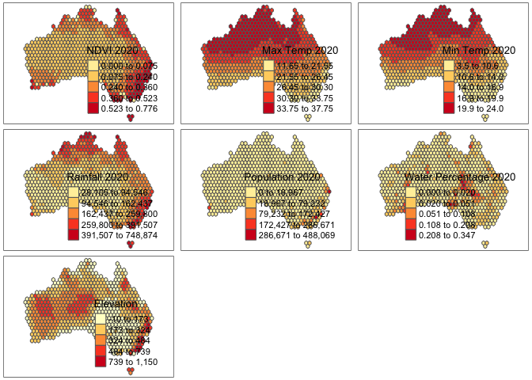<!-- -->

**Question 3** *Based on the maps from question 3, summarise major
patterns you see in the spatial distribution of these data from any of
your variables of interest. How do they appear to be associated with the
NDVI variable?*

{The maps show clear patterns across Australia. Areas with more green
vegetation (higher NDVI) are mostly along the eastern coast, especially
in the north. This is likely because these areas get more rain, which
helps plants grow. Temperatures are also interesting. The inland areas,
especially in the center and west, tend to be hotter during the day and
colder at night. This is because they are far from the coast, making
them more extreme.People (population)mostly live along the coast,
especially in the southeast. This is probably due to the better climate,
easy access to the coast, and historical reasons.Water percentage is
highest in coastal areas and around major water bodies, reflecting the
distribution of water resources. Elevation shows a general increase
towards the eastern highlands, with the highest elevations in the Great
Dividing Range. Overall, these maps show how weather, land shape, and
human all work together to shape Australia’s landscape.}

**Question 4** *Create univariate models for each of the variables
listed in question 1, with NDVI in 2020 as the dependent variable. Print
a summary of each model. Write a summary of those results that indicates
the direction, magnitude, and significance for each model coefficient.*

``` r
# Fit univariate linear regression models
model_maxtemp <- lm(ndvi_20_med ~ maxtemp_20_med, data = lab6_data)
model_mintemp <- lm(ndvi_20_med ~ mintemp_20_med, data = lab6_data)
model_rain <- lm(ndvi_20_med ~ rain_20_sum, data = lab6_data)
model_pop <- lm(ndvi_20_med ~ pop_20, data = lab6_data)
model_water <- lm(ndvi_20_med ~ water_20_pct, data = lab6_data)
model_elev <- lm(ndvi_20_med ~ elev_med, data = lab6_data)

# Print model summaries
summary(model_maxtemp)
```

    ## 
    ## Call:
    ## lm(formula = ndvi_20_med ~ maxtemp_20_med, data = lab6_data)
    ## 
    ## Residuals:
    ##      Min       1Q   Median       3Q      Max 
    ## -0.41874 -0.07657 -0.01927  0.06833  0.36382 
    ## 
    ## Coefficients:
    ##                  Estimate Std. Error t value Pr(>|t|)    
    ## (Intercept)     0.6612389  0.0294372   22.46   <2e-16 ***
    ## maxtemp_20_med -0.0130902  0.0009601  -13.63   <2e-16 ***
    ## ---
    ## Signif. codes:  0 '***' 0.001 '**' 0.01 '*' 0.05 '.' 0.1 ' ' 1
    ## 
    ## Residual standard error: 0.1251 on 714 degrees of freedom
    ## Multiple R-squared:  0.2066, Adjusted R-squared:  0.2055 
    ## F-statistic: 185.9 on 1 and 714 DF,  p-value: < 2.2e-16

``` r
summary(model_mintemp)
```

    ## 
    ## Call:
    ## lm(formula = ndvi_20_med ~ mintemp_20_med, data = lab6_data)
    ## 
    ## Residuals:
    ##      Min       1Q   Median       3Q      Max 
    ## -0.36375 -0.08418 -0.03047  0.06972  0.40383 
    ## 
    ## Coefficients:
    ##                 Estimate Std. Error t value Pr(>|t|)    
    ## (Intercept)     0.464461   0.018997   24.45   <2e-16 ***
    ## mintemp_20_med -0.012282   0.001131  -10.86   <2e-16 ***
    ## ---
    ## Signif. codes:  0 '***' 0.001 '**' 0.01 '*' 0.05 '.' 0.1 ' ' 1
    ## 
    ## Residual standard error: 0.1301 on 714 degrees of freedom
    ## Multiple R-squared:  0.1418, Adjusted R-squared:  0.1406 
    ## F-statistic:   118 on 1 and 714 DF,  p-value: < 2.2e-16

``` r
summary(model_rain)
```

    ## 
    ## Call:
    ## lm(formula = ndvi_20_med ~ rain_20_sum, data = lab6_data)
    ## 
    ## Residuals:
    ##      Min       1Q   Median       3Q      Max 
    ## -0.56681 -0.04753 -0.01210  0.04599  0.30930 
    ## 
    ## Coefficients:
    ##              Estimate Std. Error t value Pr(>|t|)    
    ## (Intercept) 1.303e-01  7.060e-03   18.45   <2e-16 ***
    ## rain_20_sum 9.124e-07  3.953e-08   23.08   <2e-16 ***
    ## ---
    ## Signif. codes:  0 '***' 0.001 '**' 0.01 '*' 0.05 '.' 0.1 ' ' 1
    ## 
    ## Residual standard error: 0.1063 on 714 degrees of freedom
    ## Multiple R-squared:  0.4273, Adjusted R-squared:  0.4265 
    ## F-statistic: 532.6 on 1 and 714 DF,  p-value: < 2.2e-16

``` r
summary(model_pop)
```

    ## 
    ## Call:
    ## lm(formula = ndvi_20_med ~ pop_20, data = lab6_data)
    ## 
    ## Residuals:
    ##      Min       1Q   Median       3Q      Max 
    ## -0.47003 -0.07883 -0.03949  0.06384  0.48974 
    ## 
    ## Coefficients:
    ##              Estimate Std. Error t value Pr(>|t|)    
    ## (Intercept) 2.552e-01  5.013e-03  50.902   <2e-16 ***
    ## pop_20      1.500e-06  1.500e-07   9.998   <2e-16 ***
    ## ---
    ## Signif. codes:  0 '***' 0.001 '**' 0.01 '*' 0.05 '.' 0.1 ' ' 1
    ## 
    ## Residual standard error: 0.1316 on 714 degrees of freedom
    ## Multiple R-squared:  0.1228, Adjusted R-squared:  0.1216 
    ## F-statistic: 99.97 on 1 and 714 DF,  p-value: < 2.2e-16

``` r
summary(model_water)
```

    ## 
    ## Call:
    ## lm(formula = ndvi_20_med ~ water_20_pct, data = lab6_data)
    ## 
    ## Residuals:
    ##      Min       1Q   Median       3Q      Max 
    ## -0.26898 -0.08838 -0.04838  0.06871  0.50911 
    ## 
    ## Coefficients:
    ##               Estimate Std. Error t value Pr(>|t|)    
    ## (Intercept)   0.268988   0.006287  42.781   <2e-16 ***
    ## water_20_pct -0.178263   0.154480  -1.154    0.249    
    ## ---
    ## Signif. codes:  0 '***' 0.001 '**' 0.01 '*' 0.05 '.' 0.1 ' ' 1
    ## 
    ## Residual standard error: 0.1403 on 714 degrees of freedom
    ## Multiple R-squared:  0.001862,   Adjusted R-squared:  0.0004636 
    ## F-statistic: 1.332 on 1 and 714 DF,  p-value: 0.2489

``` r
summary(model_elev)
```

    ## 
    ## Call:
    ## lm(formula = ndvi_20_med ~ elev_med, data = lab6_data)
    ## 
    ## Residuals:
    ##      Min       1Q   Median       3Q      Max 
    ## -0.27082 -0.09585 -0.04270  0.07954  0.44272 
    ## 
    ## Coefficients:
    ##              Estimate Std. Error t value Pr(>|t|)    
    ## (Intercept) 2.138e-01  9.741e-03  21.952  < 2e-16 ***
    ## elev_med    1.787e-04  2.895e-05   6.171 1.14e-09 ***
    ## ---
    ## Signif. codes:  0 '***' 0.001 '**' 0.01 '*' 0.05 '.' 0.1 ' ' 1
    ## 
    ## Residual standard error: 0.1369 on 714 degrees of freedom
    ## Multiple R-squared:  0.05064,    Adjusted R-squared:  0.04931 
    ## F-statistic: 38.08 on 1 and 714 DF,  p-value: 1.136e-09

{The model suggests a negative relationship between maximum temperature
and NDVI. This means that as maximum temperatures increase, NDVI tends
to decrease.The coefficient for maxtemp_20_med is statistically
significant (p-value \< 0.001), indicating a strong relationship.Similar
to the maximum temperature model, the minimum temperature model also
shows a negative relationship. Higher minimum temperatures are
associated with lower NDVI values.The coefficient for mintemp_20_med is
also statistically significant (p-value \< 0.001).The rainfall model
shows a strong positive relationship between rainfall and NDVI. This is
expected, as more rainfall generally leads to healthier vegetation. The
coefficient for rain_20_sum is highly significant, indicating a strong
relationship.The population model shows a weak positive relationship
between population and NDVI. However, the relationship is not as strong
as the relationship between NDVI and rainfall. The water percentage
model shows a weak negative relationship between water percentage and
NDVI. This suggests that areas with higher water coverage tend to have
slightly lower NDVI values. However, the relationship is not
statistically significant (p-value \> 0.05), indicating that the
observed relationship could be due to chance. The elevation model shows
a weak positive relationship between elevation and NDVI. This suggests
that higher elevations tend to have slightly higher NDVI values. This
could be due to factors such as cooler temperatures, higher
precipitation, or different soil types at higher elevations.The
coefficient for elev_med is statistically significant (p-value \<
0.001), indicating a significant relationship.While elevation shows a
significant positive relationship with NDVI, the relationship between
water percentage and NDVI is weak and not statistically significant.}

**Question 5** *Create a multivariate regression model with the
variables of interest, choosing EITHER max or min temperature (but not
both) You may also choose to leave out any variables that were
insignificant in Q4. Use the univariate models as your guide. Call the
results.*

``` r
# Multivariate model with maxtemp_20_med
multivariate_model <- lm(ndvi_20_med ~ maxtemp_20_med + rain_20_sum + pop_20 + elev_med, data = lab6_data)

# Print model summary
summary(multivariate_model)
```

    ## 
    ## Call:
    ## lm(formula = ndvi_20_med ~ maxtemp_20_med + rain_20_sum + pop_20 + 
    ##     elev_med, data = lab6_data)
    ## 
    ## Residuals:
    ##      Min       1Q   Median       3Q      Max 
    ## -0.50217 -0.02838  0.00409  0.03919  0.20570 
    ## 
    ## Coefficients:
    ##                  Estimate Std. Error t value Pr(>|t|)    
    ## (Intercept)     4.571e-01  2.194e-02  20.828  < 2e-16 ***
    ## maxtemp_20_med -1.170e-02  6.796e-04 -17.220  < 2e-16 ***
    ## rain_20_sum     8.469e-07  3.263e-08  25.953  < 2e-16 ***
    ## pop_20          2.862e-07  1.044e-07   2.741  0.00627 ** 
    ## elev_med        1.233e-04  1.796e-05   6.864 1.46e-11 ***
    ## ---
    ## Signif. codes:  0 '***' 0.001 '**' 0.01 '*' 0.05 '.' 0.1 ' ' 1
    ## 
    ## Residual standard error: 0.0845 on 711 degrees of freedom
    ## Multiple R-squared:  0.6397, Adjusted R-squared:  0.6376 
    ## F-statistic: 315.5 on 4 and 711 DF,  p-value: < 2.2e-16

**Question 6** *Summarize the results of the multivariate model. What
are the direction, magnitude, and significance of each coefficient? How
did it change from the univariate models you created in Q4 (if at all)?
What do the R2 and F-statistic values tell you about overall model fit?*

{Overall Model Fit:R-squared: The R-squared value of 0.6397 indicates
that the model explains approximately 63.97% of the variance in NDVI.
This suggests a reasonably good fit.The model explains approximately 64%
of the variance in NDVI F-statistic: The significant F-statistic 315.5
(p-value \< 2.2e-16) indicates that at least one of the predictors is
significantly related to NDVI.Extremely high F-statistic indicates the
model is significantly better than a null model. The very low p-value
confirms the model’s overall statistical significance. Residual Standard
Error: 0.0845. Indicates the average deviation of predictions from
actual values. Relatively small compared to the scale of NDVI (which
ranges from 0 to 1) Coefficient Interpretation: Maximum Temperature: The
negative coefficient for maxtemp_20_med confirms a negative relationship
(-0.0117) observed. Higher maximum temperatures are associated with
lower NDVI values.For each 1°C increase in maximum temperature, NDVI
decreases by 0.0117 units Rainfall: The positive coefficient for
rain_20_sum reinforces the strong positive relationship (8.469e-07)
between rainfall and NDVI. More rainfall leads to higher NDVI values.For
each 1mm increase in rainfall, NDVI increases by 0.0000008469 units
Population: The positive coefficient (2.862e-07) for pop_20 suggests
that higher population density is associated with slightly higher NDVI
values, potentially due to urban greening efforts or agricultural
activities.For each additional person, NDVI increases by 0.0000002862
units Elevation: The positive coefficient (0.0001233) for elev_med
indicates that higher elevations are associated with higher NDVI values.
This could be due to factors like cooler temperatures, higher
precipitation, or different soil types at higher elevations. For each 1m
increase in elevation, NDVI increases by 0.0001233 units Comparison with
Univariate Models:The coefficients and significance levels of the
predictors in the multivariate model are generally consistent with the
univariate models. However, the multivariate model provides a more
comprehensive understanding of the relationships between NDVI and the
predictors, accounting for the potential confounding effects of other
variables.The multivariate model suggests that rainfall is the most
important factor influencing NDVI, followed by maximum temperature and
elevation. Population also has a significant, albeit weaker, positive
impact on NDVI.}

**Question 7** *Use a histogram and a map to assess the normality of
residuals and any spatial autocorrelation. Summarise any notable
patterns that you see.*

``` r
# Add residuals to the sf dataframe
lab6_data$model_residuals <- residuals(multivariate_model)


# Create histogram
ggplot(data = data.frame(residuals = residuals(multivariate_model)), aes(x = residuals)) +
  geom_histogram(bins = 30, fill = "steelblue", color = "black") +
  theme_minimal() +
  labs(title = "Histogram of Model Residuals",
       x = "Residuals",
       y = "Count")
```

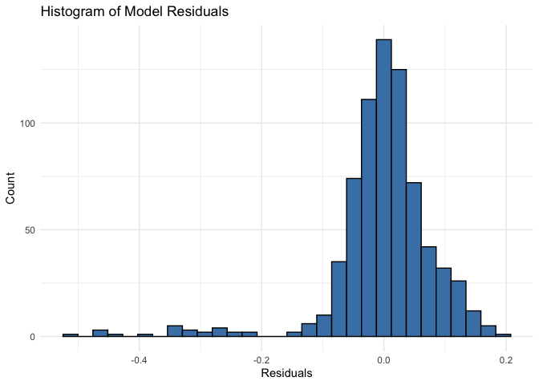<!-- -->

``` r
# Create map using the verified column name
tm_shape(lab6_data) +
  tm_fill(col = "model_residuals",  # using col instead of directly naming
          style = "jenks",
          palette = "RdBu",
          midpoint = 0,
          title = "Model Residuals") +
  tm_borders(alpha = 0.2) +
  tm_layout(title = "Spatial Distribution of Model Residuals",
            legend.position = c("right", "bottom"))
```

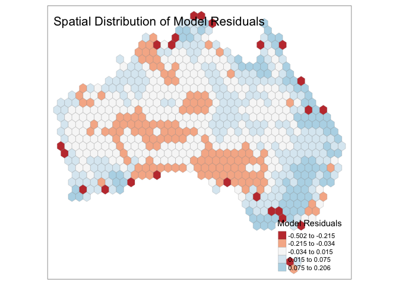<!-- -->

``` r
# Let's also print the first few residual values to verify they exist
head(lab6_data$model_residuals)
```

    ## [1]  0.05437393 -0.21518205  0.05035722  0.04231524  0.07312615 -0.23149856

{Based on these visualizations, here are the notable patterns in the
model residuals: 1. Distribution of Residuals (from Histogram):The
residuals are not normally distributed and has some deviations. There’s
a notable left skew (negative skew). The bulk of residuals cluster
around zero, suggesting generally good model fit - There are some
outliers, particularly on the negative side (around -0.4 to -0.5) - The
distribution shows a longer tail on the left side than the right side 2.
Spatial Patterns (from Map): Clear spatial clustering of residuals is
evident. Central Australia shows a concentration of negative residuals
(red/pink colors), indicating the model over-predicts NDVI in these
areas. Coastal areas, particularly in the east and southeast, tend to
have positive residuals (blue colors), suggesting the model
under-predicts NDVI in these regions. The spatial clustering suggests
the presence of spatial autocorrelation in the residuals.The strongest
over-predictions (darkest red) appear in scattered locations across the
continent, particularly along the edges 3. Model Performance
Implications: - The spatial clustering suggests there may be regional
factors affecting NDVI that aren’t fully captured by the global model.
The model tends to systematically over-predict in arid interior regions
and under-predict in coastal areas.The presence of spatial
autocorrelation indicates that a spatial regression approach might be
more appropriate. The residual range (-0.502 to 0.206) suggests moderate
prediction errors relative to typical NDVI values These patterns suggest
that while the model captures broad trends, there are systematic spatial
biases that could potentially be addressed through spatial regression
techniques or additional variables that capture regional variation.}

**Question 8** *Assess any issues with multicollinearity or
heteroskedastity in this model using the techniques shown in class. Run
the appropriate tests and explain what their results show you.*

``` r
# Check for multicollinearity using VIF
vif(multivariate_model)
```

    ## maxtemp_20_med    rain_20_sum         pop_20       elev_med 
    ##       1.098705       1.078449       1.173863       1.009305

``` r
# Test for heteroskedasticity using Breusch-Pagan test
bptest(multivariate_model)
```

    ## 
    ##  studentized Breusch-Pagan test
    ## 
    ## data:  multivariate_model
    ## BP = 122.21, df = 4, p-value < 2.2e-16

``` r
# Visual check for heteroskedasticity
plot(fitted(multivariate_model), residuals(multivariate_model),
     xlab = "Fitted values", 
     ylab = "Residuals",
     main = "Residuals vs Fitted Values")
abline(h = 0, col = "red", lty = 2)  # Add reference line at y=0
# Add a smooth line to help identify patterns
lines(smooth.spline(fitted(multivariate_model), residuals(multivariate_model)), 
      col = "blue")
```

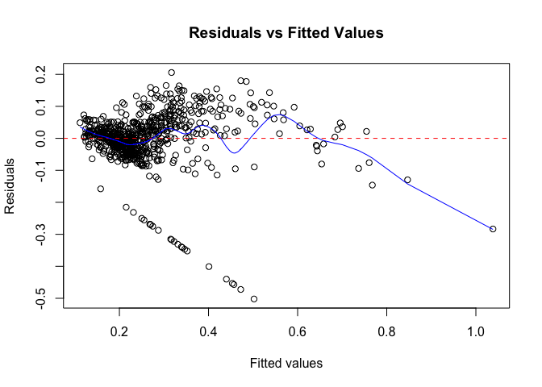<!-- -->

{Based on the diagnostic tests and visualization, the regression model
shows mixed results regarding its statistical assumptions. For
multicollinearity, the VIF (Variance Inflation Factor) values for all
predictors (maxtemp_20_med: 1.099, rain_20_sum: 1.078, pop_20: 1.174,
elev_med: 1.009) are well below the common threshold of 5-10, indicating
that multicollinearity is not a concern in this model. This means our
predictors are relatively independent of each other, allowing for
reliable interpretation of individual coefficient effects. However, the
model shows significant issues with heteroskedasticity, as shown by both
statistical testing and visual inspection. The Breusch-Pagan test
indicated a highly significant result (BP = 122.21, p \< 2.2e-16),
strongly rejecting the null hypothesis of homoskedasticity. This is
visually confirmed in the Residuals vs Fitted Values plot, which shows
clear patterns including a fan-like spread of residuals, a curved
pattern in the smoothing line, and a distinctive cluster of negative
residuals forming a diagonal line. The uneven spread of residuals across
different fitted values further supports the presence of
heteroskedasticity.}

**Question 9** *How would you summarise the results of this model in a
sentence or two? In addition, looking at the full model and your
diagnostics, do you feel this is a model that provides meaningful
results? Explain your answer.*

{The model reveals that vegetation (NDVI) in Australia is significantly
influenced by environmental factors, with maximum temperature having a
negative effect while rainfall, population, and elevation show positive
relationships, together explaining 64% of NDVI variation. While the
model offers meaningful insights into broad vegetation patterns, its
reliability is compromised by significant heteroskedasticity and spatial
autocorrelation, suggesting that a more specialized spatial regression
approach might better capture the geographic variations in these
relationships across Australia.}

**Disclosure of assistance:** *Besides class materials, what other
sources of assistance did you use while completing this lab? These can
include input from classmates, relevant material identified through web
searches (e.g., Stack Overflow), or assistance from ChatGPT or other AI
tools. How did these sources support your own learning in completing
this lab?*

{I used R documentation and Gemini to better understand certain tmap
parameter options, particularly for managing the color palette and
legend positions in the residuals map. I also consulted the car package
documentation to properly interpret VIF values and their thresholds for
multicollinearity assessment. When formatting the residuals vs fitted
plot. These resources helped deepen my understanding of regression
diagnostics and spatial data visualization techniques beyond what was
covered in class materials.}

**Lab reflection:** *How do you feel about the work you did on this lab?
Was it easy, moderate, or hard? What were the biggest things you learned
by completing it?*

{I found this lab moderately challenging, with some aspects being more
difficult than others. The initial data visualization and basic
regression analysis steps were straightforward, but the interpretation
of diagnostics, particularly understanding the implications of spatial
autocorrelation and heteroskedasticity, required deeper thought and
understanding.The biggest things I learned from completing this lab
were: 1. The importance of systematic model diagnostics - seeing how
residual patterns in both maps and plots can reveal underlying issues
with model assumptions 2. Understanding that a statistically significant
model (like this one with R² = 0.64) can still have important
limitations due to violated assumptions 3. The practical application of
creating interpretable visualizations, especially when dealing with
positive and negative values in spatial data.}

**Challenge question**

\#Option 1 Create a first difference model. To do that, subtract the
values in 2000 from the values in 2020 for each variable for which that
is appropriate. Then create a new model similar to the one you created
in question 5, but using these new variables showing the *change in
values* over time. Call the results of the model, and interpret the
results in the same ways you did above. Also chart and map the residuals
to assess model error. Finally, write a short section that summarises
what, if anything, this model tells you.

\#Option 2 The animal data included in this dataset is an example of
count data, and usually we would use a Poisson or similar model for that
purpose. Let’s try it with regular OLS regression though. Create two
regression models to assess how the counts of two different animals
(say, koalas and emus) are associated with at least three of the
environmental/climatological variables given above. Be sure to use the
same independent variables in each model. Interpret the results of each
model and then explain the importance of any differences in the model
coefficients between them, focusing on direction, magnitude, and
significance.
